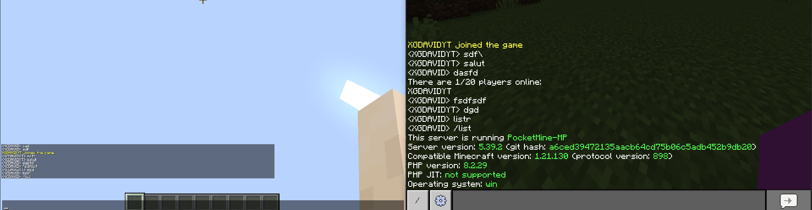

# BigBrother for PocketMine-MP 5.x

**Allows Minecraft: Java Edition clients to connect to PocketMine-MP servers**

# ⚠️ **NOTE:** A new project with the same goal, targeting a newer Minecraft version (1.18.2) and much more optimized, is currently in development: **XGTJavaBridge**.  
For more information and updates, join the [Discord](https://discord.gg/nPDC7FPbw8)



## ⚠️ IMPORTANT DISCLAIMER

**This plugin is EXPERIMENTAL and largely NON-FUNCTIONAL.**

### What DOES NOT work:

- ❌ **Chunks/World rendering** - You cannot see any blocks
- ❌ Player visibility between Java and Bedrock
- ❌ Player list (TAB) integration
- ❌ Movement synchronization
- ❌ Block interactions
- ❌ Entity management
- ❌ Inventory system
- ❌ Commands from Java client
- ❌ Many, many other features

### What partially works:

- ✅ Server appears in Java Edition server list
- ✅ Connection establishment
- ✅ Basic chat (bidirectional between Java and Bedrock)
- ✅ Keep-alive (no timeout)

**⚠️ This plugin will likely NOT receive further updates. Use at your own risk.**

---

## History

This is an **experimental port** of BigBrother for PocketMine-MP 5.x. The original BigBrother plugin was designed for
PMMP 3.x.

- **Original Authors:** shoghicp, BigBrotherTeam
- **PocketMine-MP 5.x Port (2026):** [XGDAVID](https://github.com/xgdavid)

## Requirements

- PocketMine-MP 5.x
- PHP 8.1+
- ext-pmmpthread
- ext-openssl (for online mode)
- ext-zlib
- ext-sockets

## Installation

1. Download or clone this plugin to your `plugins` folder
2. (Optional) Run `composer install` in the plugin directory for online mode support
3. Start your PocketMine-MP server
4. Configure `plugins/BigBrother/config.yml`

## Configuration

```yaml
# Network interface to bind to
interface: "0.0.0.0"

# Port for Java Edition clients (default Minecraft Java port)
port: 25565

# Compression threshold for network packets
network-compression-threshold: 256

# Server description shown in server list
motd: "§bPocketMine-MP Server\n§aUsing BigBrother for Java Edition support"

# Use Mojang authentication (requires phpseclib3)
online-mode: false

# Prefix for Java Edition player names
desktop-prefix: "PC_"
```

## Supported Versions

- **Target Minecraft Java Edition:** 1.12.2
- **Protocol Version:** 340
- **PocketMine-MP API:** 5.0.0+

## Files Updated for PM5 (2026 by XGDAVID)

The following core files have been rewritten for PocketMine-MP 5.x:

- `BigBrother.php` - Main plugin class
- `network/ProtocolInterface.php` - Network interface implementation
- `network/ServerThread.php` - Thread handling for Java connections
- `network/ServerManager.php` - Connection management
- `network/Session.php` - Individual client sessions
- `network/JavaPlayer.php` - Java Edition player handler
- `network/Packet.php` - Base packet class
- `network/InboundPacket.php` - Client→Server packets
- `network/OutboundPacket.php` - Server→Client packets
- `utils/Binary.php` - Binary data utilities
- `utils/ConvertUtils.php` - Data conversion utilities

## Credits

- **shoghicp** - Original BigBrother creator
- **BigBrotherTeam** - Maintenance and updates
- **[XGDAVID](https://github.com/xgdavid)** - Update for PocketMine-MP 5.x (2026)
- **hmy2001, eternalharvest, SuperMaXAleX, caspervanneck, DrewD3V** - Original contributors

## License

LGPL-3.0

## Links

- [Original Repository](https://github.com/BigBrotherTeam/BigBrother)
- [PocketMine-MP](https://github.com/pmmp/PocketMine-MP)
- [Java Edition Protocol](https://wiki.vg/Protocol)
- [XGDAVID GitHub](https://github.com/xgdavid)
